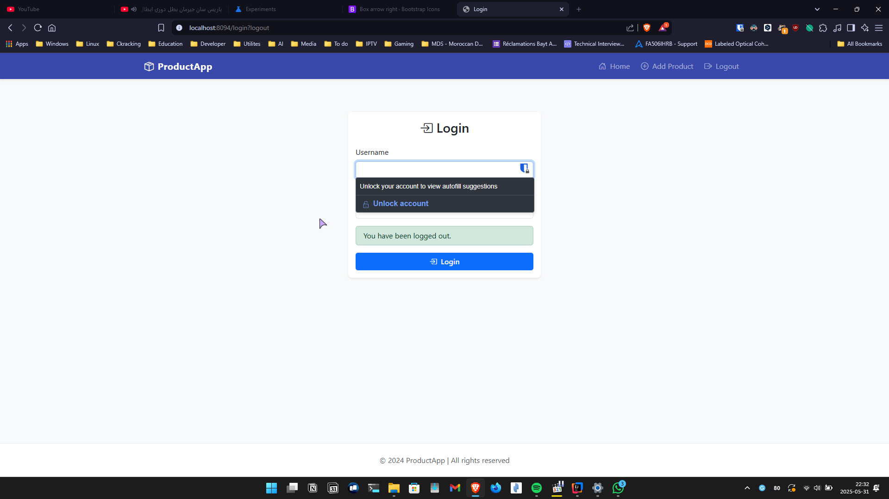
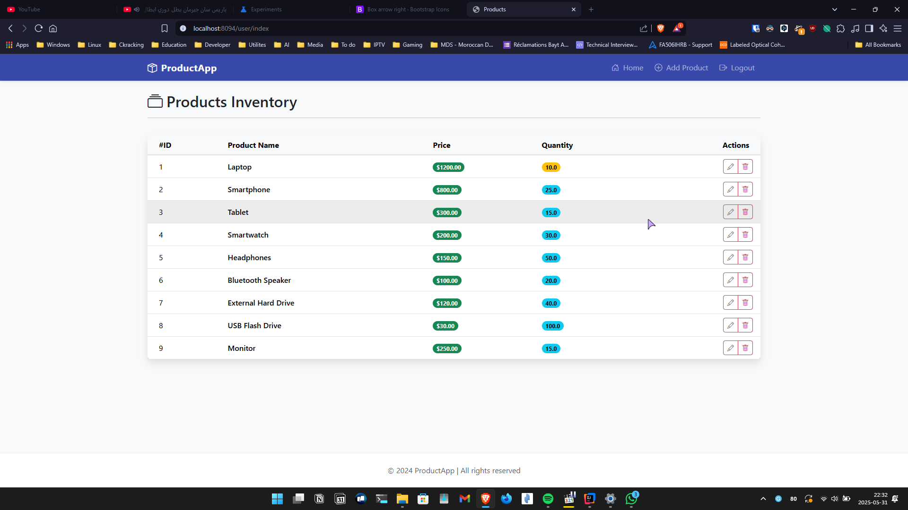
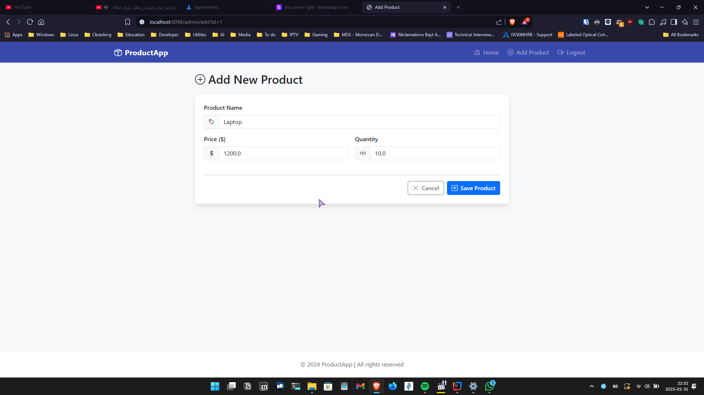
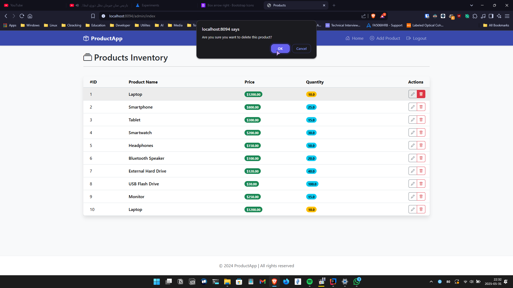
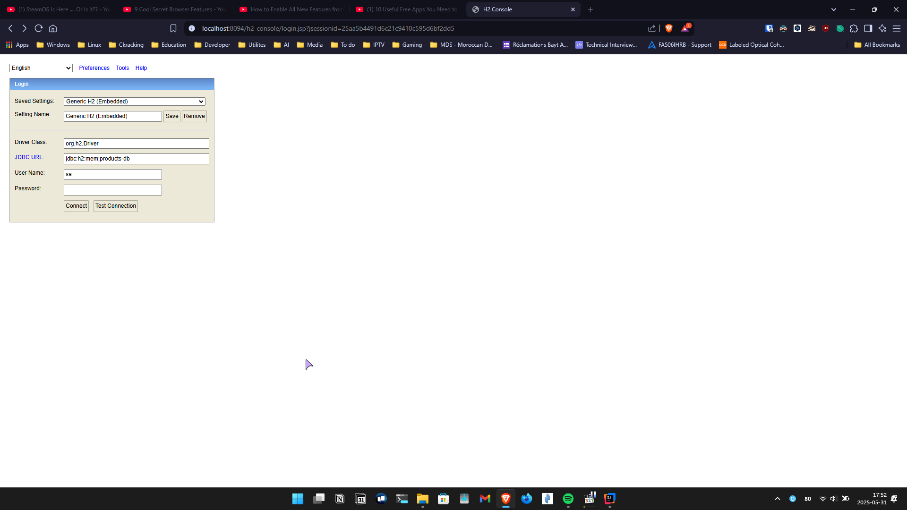
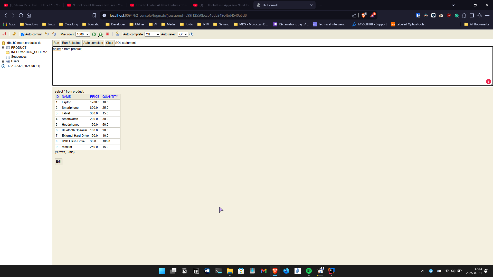
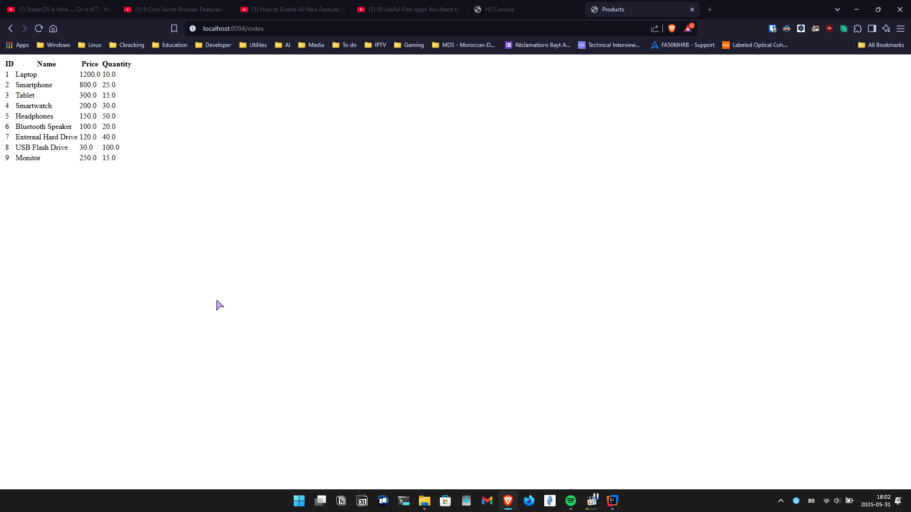

# Products Management System

[](LICENSE) 

A simple Products Management System built with Spring Boot. This application allows you to manage products (add, edit, delete, and list) via a web UI and basic authentication.

## Table of Contents
1. [Introduction](#introduction)
2. [Features](#features)
3. [Installation](#installation)
4. [Usage](#usage)
5. [Technologies Used](#technologies-used)
6. [Project Structure](#project-structure)
7. [Development Setup](#development-setup)
8. [Testing](#testing)
9. [Screenshots](#screenshots)
10. [Contributing](#contributing)
11. [License](#license)
12. [Contact](#contact)

## Introduction
A Spring Boot–based CRUD application to manage products, featuring secure log-in/out and an in-memory H2 database for rapid development.

**Author:** Tajeddine Bouhrim (Master SDIA)

## Features
- List all products
- Add new products
- Edit existing products
- Delete products
- User authentication (login/logout)
- H2 in-memory database for development

## Installation
1. Prerequisites:
   - Java 17 or later
   - Maven
2. Clone the repo:
   ```bash
   git clone https://github.com/scorpionTaj/products-management-system.git
   cd products-management-system
   ```
3. Build the application:
   ```bash
   ./mvnw clean package
   ```

## Usage
Start the server:
```bash
./mvnw spring-boot:run
```
Open your browser to http://localhost:8094/.

Default User Credentials:
- Username: `user1` or `user2`
- Password: `1234`

Admin Credentials:
- Username: `admin`
- Password: `1234`

## Technologies Used
- Spring Boot
- Spring MVC (Thymeleaf)
- Spring Data JPA
- H2 Database
- Maven
- Java 17

## Project Structure
```
products-management-system/
├── src/
│   ├── main/
│   │   ├── java/   # application code
│   │   └── resources/   # templates, static assets, application.properties
│   └── test/   # unit/integration tests
├── mvnw, mvnw.cmd
├── pom.xml
└── README.md
```

## Development Setup
Access the H2 console at http://localhost:8094/h2-console  
- JDBC URL: `jdbc:h2:mem:testdb`  
- User Name: `sa`  
- Password: *(leave blank)*

## Testing
Use the web interface to verify all CRUD operations and authentication flows.

## Screenshots

1. **Login Page**  
   
2. **Products List**  
   
3. **Add Product**  
   
4. **Edit Product**  
   
5. **Delete Product**  
   
6. **H2 Database Console**  
   
7. **H2 Database View**  
   
8. **H2 Password Dialog**  
   
9. **Access Denied**  
   
10. **Project Structure in IntelliJ IDEA**  
    

## Contributing
Contributions are welcome! Please open an issue or submit a pull request.

## License

This project is licensed under the MIT License. See the [LICENSE](LICENSE) file for details.

